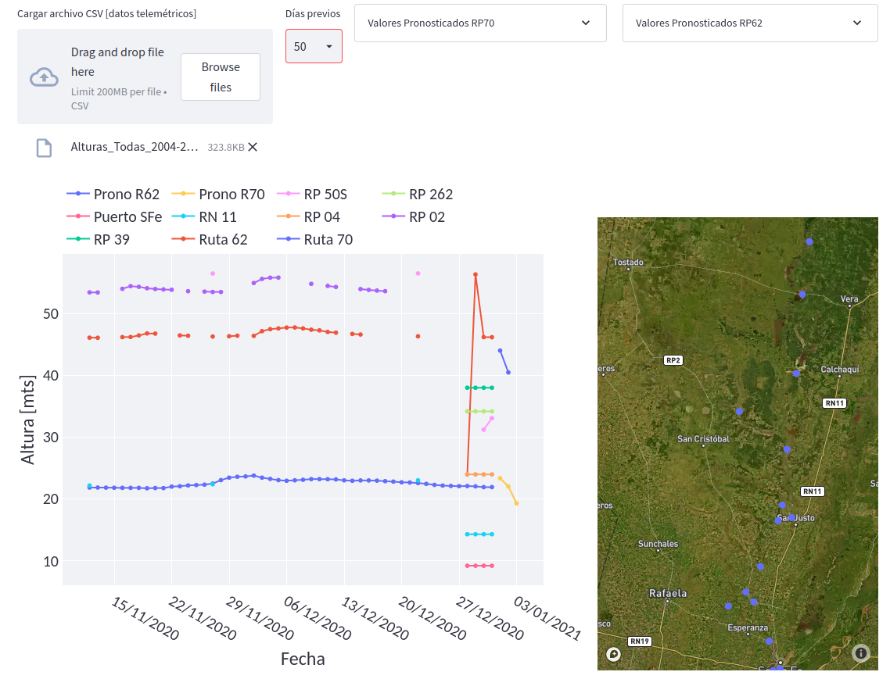

# pysalado

https://emilopez-pysalado-webapp-mhmb0z.streamlitapp.com/


Uno de ellos estático, en el que no se realizan modificaciones por parte del usuario, y otro dinámico, donde se cargan las alturas de las estaciones para cada fecha. 

- `meta_estaciones_sah.csv`: en un archivo denominado `meta_estaciones_sah.csv` se encuentran las coordenadas (latitud, longitud) de las estaciones de la red de alerta del Río Salado. Este archivo no se modifica ni se selecciona en ninguna instancia. Simplemente lo utiliza el sofware para ubicaar los puntos sobre el mapa.

- `archivo_con_alturas.csv`: en un archivo `csv` (sin importar el nombre de archivo)  se ingresan las alturas de cada estación. Cada fila es para una fecha determinada y las columnas se corresponden con las diferentes estaciones.   

```{mermaid}
flowchart LR
  A[altura_estaciones.csv] --> C(visualizador)
  B[meta_estaciones_sah.csv] --> C(visualizador)
  C(visualizador) --> D[]
  
```